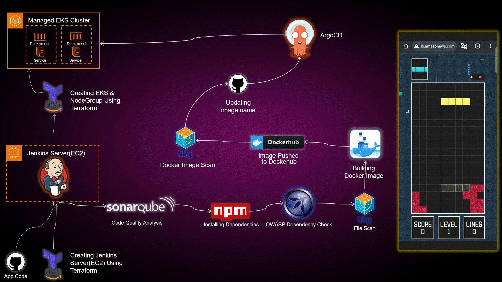

# 🚀 End-to-End DevSecOps Kubernetes Project 🌐

[](https://www.linkedin.com/in/aman-devops/)
[](https://github.com/AmanPathak-DevOps)




Welcome to an immersive DevSecOps learning experience! This project guides you through deploying a Tetris game on AWS EKS while mastering the art of DevSecOps.

## Directories 📂

1. **EKS-TF:** Explore Terraform scripts for deploying EKS clusters on AWS.
2. **Jenkins-Pipeline-Code:** Jenkins pipeline code for automated CI/CD.
3. **Jenkins-Server-TF:** Terraform scripts for provisioning Jenkins servers on AWS EC2.
4. **Manifest-file:** Kubernetes manifest files for Tetris application deployment.
5. **Tetris-V1:** Initial version of the Tetris game application.
6. **Tetris-V2:** Enhanced version of the Tetris game application.

## Getting Started 🚀

1. **Clone the Repository:**
   ```bash
   git clone https://github.com/AmanPathak-DevOps/End-to-End-Kubernetes-DevSecOps-Tetris-Project.git
2. **Explore the Directories:**
   Navigate into each directory to find detailed scripts, pipelines, and configurations.

3. **Follow the Blog:**
   Implementation details and insights are documented in the associated [blog post](https://github.com/prashantshingote62-code/end-to-end-devsecops-game-.git).

## Tools Explored 🛠️
1. **Jenkins:** Automated CI/CD pipelines
2. **ArgoCD:** Continuous deployment to Kubernetes
3. **Kubernetes:** Orchestration for containerized applications
4. **Trivy:** Container vulnerability scanner
5. **OWASP Dependency-Check:** Ensuring secure dependencies
6. **Docker:** Containerized application deployment
7. **SonarQube:** Unveiling code quality insights
8. **Terraform:** Infrastructure as Code for AWS EKS
